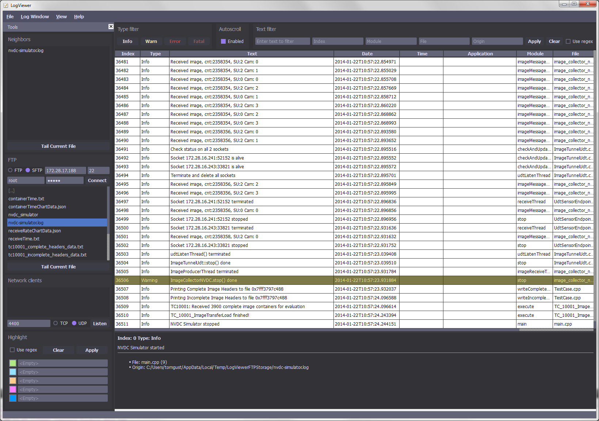

log_viewer
==========

Platform independent graphical log viewer

The most important factor for me when I decided to start this project was the fact that I did not like the look-and-feel of existing log viewer software.

Features
* Intuitive look-and-feel.
* Platform independent.
* Open and view logs in a table view. Supports drag n' drop.
* When a file has been opened view its neighbor files directly in a list for easy access.
* Tail log file.
* Use built-in log server to listen to log clients using sockets.
* Table color codes for log entry types.
* Highlight text with color, simple text or use regular expression.
* Fast filter on text, simple text or use regular expression.
* Auto-sense log format.
* Log format support is extendable in code.
* The initial log formats are taken from logs produced by log4cxx
* Developed in QT 4.7.1
* C++
* Coding standard: JSF

Run doxygen in log_viewer folder to create code documentation.
